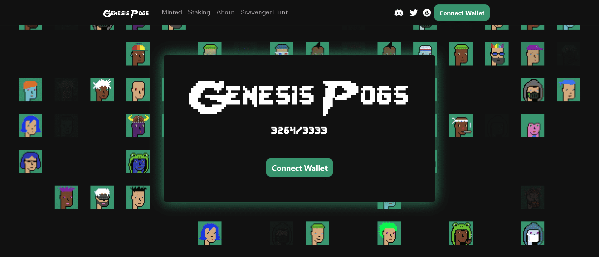

# PogPunks NFT

位于第一个多链元节中心的朋克派系。

游戏玩家 (PoGs) 将成为第一个使用名为 Multiverse Oasis (MVO) 的平台的 NFT 社区。MVO 是一个 MMO 生成器，它将使所有 NFT 社区——不仅仅是拥有雄厚财力和资源的社区——能够轻松创建自己的去中心化、高保真 MMO。

社区通过大力投资艺术、传说、漫画书、商品、IRL 活动、寻宝游戏和视频游戏，将 PoG 打造成为最引人注目的项目之一。

Genesis PoGs 是一组 ERC-721 像素艺术代币，于 2021 年 9 月为 PoGs 项目的早期支持者创建。由于 CryptoPunks 及其衍生项目，像素艺术在当时的创作和标志性方面非常迅速。我们知道建立 MVO 和一个令人难以置信的 metaverse 品牌需要几个月的时间，但我们不想等待开始建立一个强大的社区。Genesis PoG 为早期成员提供了经济激励，以支持我们的愿景并帮助我们建立一个充满活力的社区。我们坚信奖励我们最早的支持者。Genesis PoGs 持有者可以免费铸造他们的 PoGs。他们还将最早接触到我们所有的新开发，包括 MVO、Riddleware、NFT 空投、商品投递和 IRL 活动。此外，质押 Genesis PoG 将提供所有质押机制中最多的 $PAO（PoG 货币）。Genesis PoG 的铸币窗口将在 PoG 启动前关闭。

