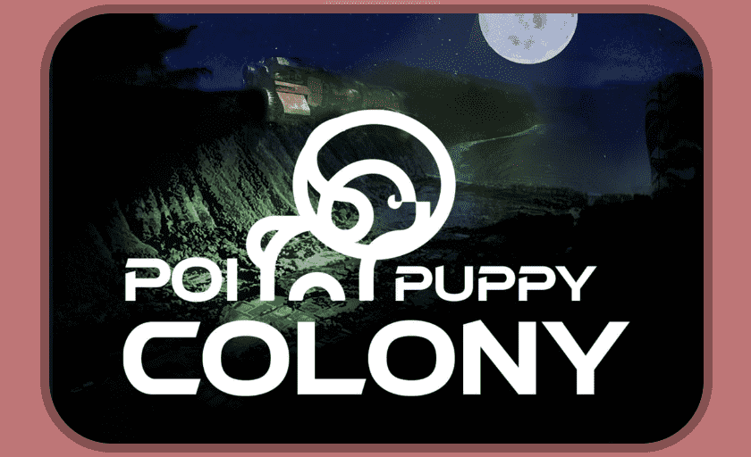

# Poi Puppy Colony

E Komo mai（来吧），在一段史诗般的旅程中，我们讲述了 Poi Puppy Colony 的古老故事，你的 LOST Pup NFT 兼作你的服务小狗，在他们的任务中为你提供情感支持。

许多个月前，一个由 10,000 只小狗组成的独特而精选的包被组装起来对月球进行地球化改造。该项目被称为Poi Puppy Colony。

Bokikumanomano 神话中的 Alpha 幼崽，在 Kalaupapa 的 Kalawao 高耸的悬崖上发出黄昏的嚎叫，集结狼群以收集他们古老物种的残余资源和深奥的知识，以完成建造一艘将它们运送到避难所的原始方舟的艰巨任务我们遥远的月亮。

哎呀！（翻译：*哦，WOE！）*在方舟进入太空的最后阶段，推进力受到损害，导致方舟的幼崽有效载荷发生灾难性爆炸……但在配备贵宾犬降落伞和金毛猎犬滑翔机的救援哈巴狗舱中及时逃生之前。10,000 只幼崽散布在整个对流层中，与碎片回到严峻的地球表面进行了一场危险的竞赛。

那些没有幸存下来的人，以僵尸幼崽（僵尸幼崽）的身份复活，而其他在爆炸期间暴露于有毒的地球化化学物质并遭受 DNA 改变的人。幸存的大多数幼崽试图重组殖民地以执行 ORDER K-9 的应急计划。

