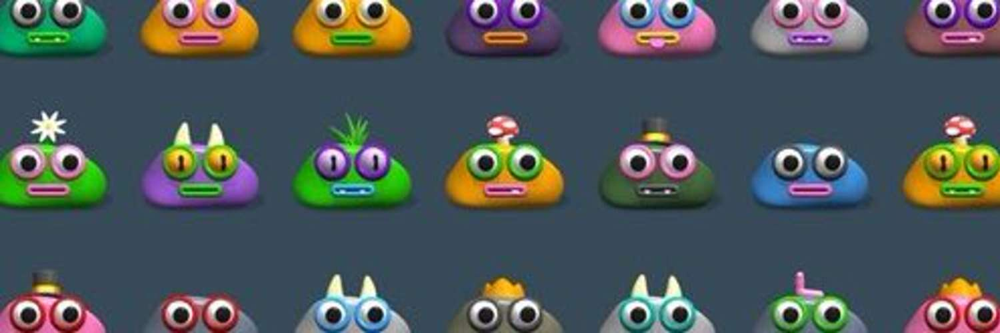

# Pointless Pebbles

Pointless Pebbles 是一个很小的集合~~727~~726 个微小的生成的鹅卵石。永远不会死的宠物！

每个 Pointless Pebble 都带有 1 个免费的 Nounish Pebble。

▶ 什么是无意义的鹅卵石？
Pointless Pebbles 是一个 NFT（不可替代令牌）集合。存储在区块链上的数字艺术品集合。

▶ 有多少个 Pointless Pebbles 代币？
总共有 726 个 Pointless Pebbles NFT。目前，182 位所有者的钱包中至少有一个 Pointless Pebbles NTF。

