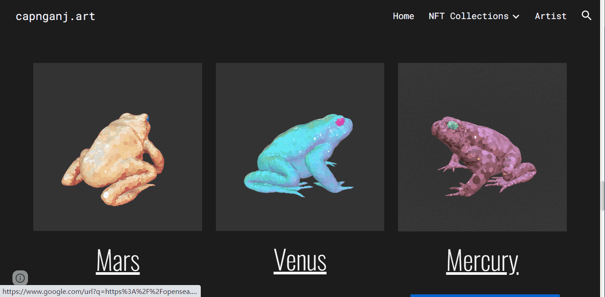

# Poison Toads Utility

Poison Toads 是 Polygon 区块链上迷幻蟾蜍图画的生成集合。 如果你舔你的屏幕，你会绊倒你的退化脸<3
每个蟾蜍 NFT 都是通过算法生成的，并且具有独特的颜色分布和平铺图案。
都是 Polygon 上的 1/1 ERC721 代币。
斯托纳艺术是实用的！
毒蟾蜍没有白名单。 相反，这 3 个实用代币将用于通过在铸币期间提供深度折扣来激励铸币。
最常见的实用蟾蜍。 100 个版本。 Hodlers 可以以 1/2 的价格铸币
罕见的蟾蜍！ 20 个版本。 Hodlers 可以以 1/4 的价格铸币
最稀有 - 仅 5 个版本！ Hodlers 可以以 1/8 的价格铸币

