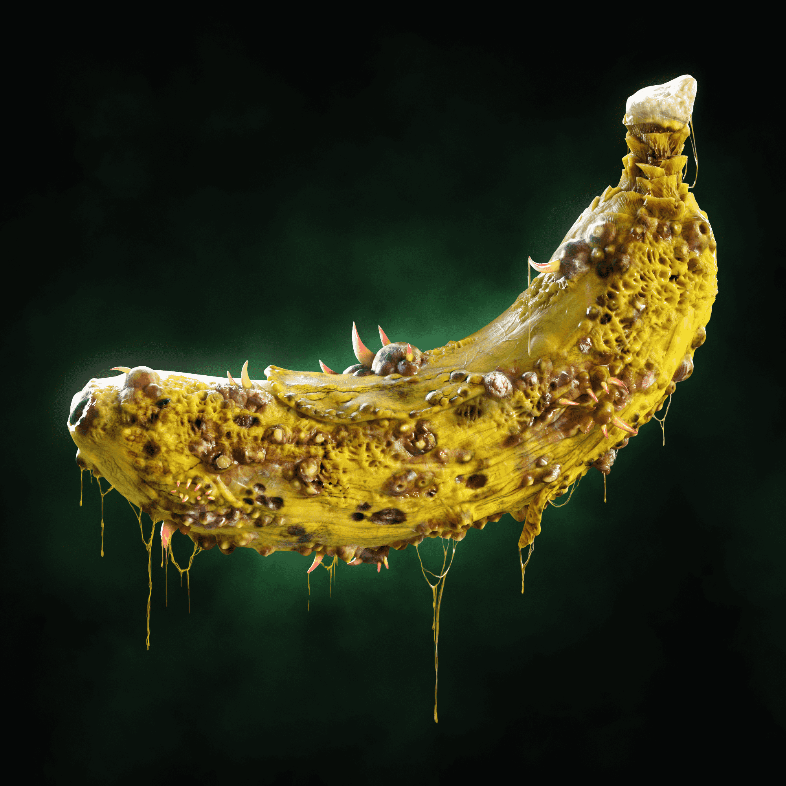

# Poisoned Bananas

我们即将推出的 Prime 生态系统是战略和经济游戏的结合。我们每一位 Prime Apes、Prime Kong 或 Infected Prime Apes 的忠实持有者都将有机会质押他们的 NFT 以换取代币奖励。该代币具有许多好处和用例，例如购买商品、其他即将到来的蓝筹项目的白名单、访问我们的游戏赚钱游戏、对我们的 Prime DAO 中的重大决策进行投票的权利以及交换到 ETH流动性现金返还。
对我们来说，创建一个平衡的 Prime 生态系统非常重要，该系统具有多个用例和不同的好处，吸引每个人。这确保了一个长期的循环经济，我们所有的持有者都可以给予和接受。所有这些实用程序都将通过我们独家的 Prime Holders 平台提供。这个平台得到了我们社区成员的大力支持，这从大量支持它的选票中可以看出。在此之后，我们迅速开始与我们的开发人员就平台进行合作，目前我们的区块链专家正在对该项目及其所有方面进行概述。我们计划在 2022 年 5 月推出独家持有者专属平台。

