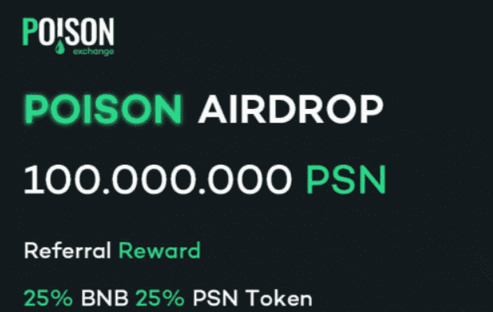

# PoisonSwap

赚取更多 PSN 邀请好友并通过空投和预售获得 25% BNB 和 PSN 奖励。

**2021 年 8 月 5 日 - 空投**

参与者可以加入空投，之后他们可以将他们的 PSN 代币兑换成 PSX 代币

**2021 年 8 月 5 日 - 公开发售**

参与者可以参加公开发售。销售价格 ：1 PSX = 0.085 美元和上市价格 1 PSX = 0.1 美元

**2021 年 9 月 5 日 - 增加流动性和开放农场**

流动性将立即添加到 PancakeSwap。PSN v2 代币现在可在Swapping界面交易。用户可以使用流动性代币在 Farm 上进行质押。LP提供者将开始因提供流动性而获得奖励。

**2021 年 9 月 22 日 - 开放 NFT 和经典池**

在此步骤中，池将可用于质押代币，代币质押者可以通过奖励系统获得被动收入。

