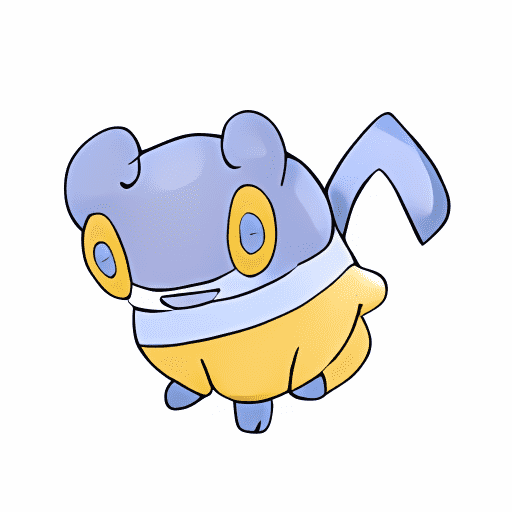

# PokeGAN by NotNintendo

NotNintendo NFT 的 PokeGAN - 常见问题（FAQ）
▶ NotNintendo 的 PokeGAN 是什么？
NotNintendo 的 PokeGAN 是一个 NFT（不可替代令牌）集合。存储在区块链上的数字艺术品集合。
▶ NotNintendo 代币有多少 PokeGAN？
NotNintendo NFT 总共有 4,003 个 PokeGAN。目前，922 位所有者的钱包中至少有一个 NotNintendo NTF 的 PokeGAN。
▶ NotNintendo 出售的最昂贵的 PokeGAN 是什么？
NotNintendo NFT 出售的最昂贵的 PokeGAN 是 #60。它于 2022 年 7 月 3 日（2 个月前）以 274.4 美元的价格售出。
▶ NotNintendo 的 PokeGAN 最近卖出了多少？
过去 30 天内售出了 312 个由 NotNintendo NFT 制作的 PokeGAN。
▶ NotNintendo 的 PokeGAN 需要多少钱？
在过去的 30 天里，NotNintendo NFT 的 PokeGAN 最便宜的销售额低于 60 美元，最高销售额超过 88 美元。NotNintendo NFT 的 PokeGAN 的中位价格在过去 30 天内为 70 美元。
▶ NotNintendo 流行的 PokeGAN 替代品有哪些？
许多拥有 NotNintendo NFTs PokeGAN 的用户还拥有 Pepe Liberation Army、 CryptoPhunks、 -BRICKS-和 MaMoMe。

