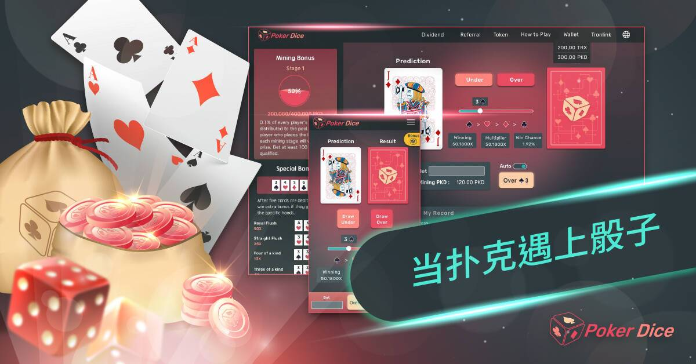

# Poker Dice

PokerDice 结合了最热门的骰子游戏和扑克牌元素，选好你的幸运牌後下好离手，等到比大小结果出炉，将决定好运能否为你带来TRX奖金。

除了进行比大小之外，每5张连续开出的牌会形成一个牌组，假如成功凑出指定的特殊牌型，像是同花顺丶四条丶顺子，玩家还可获得额外奖励。

每次玩 PokerDice，玩家都会获得 PKD 通证。将 PKD 通证进行冻结後，就能每天获得由分润池中所发出的分润。所有的 PKD 通证都将由挖矿产出，共分为 1000 个阶段，每进行到下个阶段，挖矿难度会随之增加。此外，如果成为每个阶段结束前，最後一位下注的玩家，也会有额外的奖励。

邀请朋友一起来试试手气，成功邀请後，朋友挖到的 PKD 通证将会额外产生10%的数量，提供给推荐人作为奖励。
