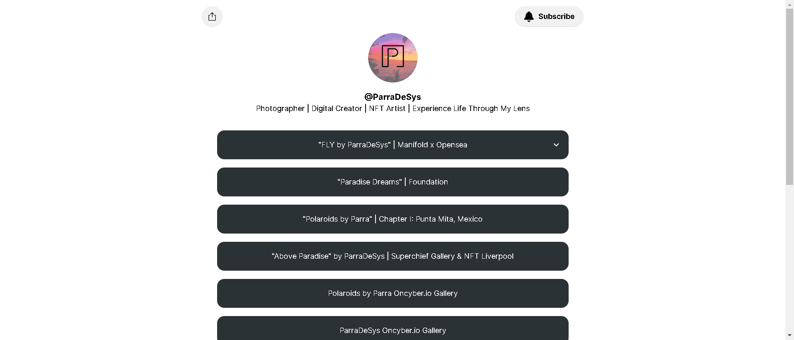

# Polaroids by Parra

“Parra 的宝丽来”是一个使用我祖父 1970 年代宝丽来相机的持续收藏。

我的故事开始于 2022 年初，在我发现他的相机在我父母的地下室积满灰尘超过 25 年之后。

该系列由 Manifold (ERC-721) 铸造而成，并利用区块链上的七个稀有特征。

“Parra 拍立得照片”的每一章都将通过 1 张照片中的 1 张来讲述一个在我生命中具有重要意义的地方的故事。将向所有章节收藏者空投一张特别版宝丽来，每章的“为什么”。

我的祖父一直是我生活中的灵感来源。他是一名黑白电影摄影师，我记得我小时候他拍过照片，但我太小了，无法欣赏。我的名字 ParraDeSys 向他致敬。

请和我一起踏上这段旅程，因为我通过我祖父的镜头学习电影摄影，并在以太坊区块链上铸造这些永恒的宝丽来。

