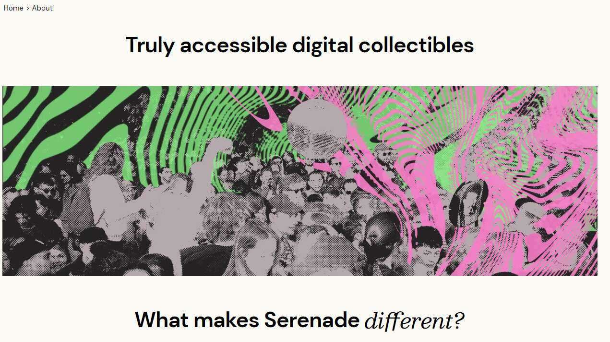

# Polite Teehee First Edition

艺术家不断被要求超越他们的音乐来谋生。我们希望艺术家成为艺术家，并通过为粉丝制作的真实艺术来实现创作独立。

在艺术家可以吸引一小部分忠实粉丝的地方，他们可以通过激情和狂热的亲密社区发展可持续的职业生涯。

我们正在从唱片、
T 恤和海报停止的地方开始，使用新技术来支持古老的狂热行为和社区认同。

所有行业利益相关者——唱片公司、出版商、推广者和代理商——都应该为他们的知识产权得到补偿，因为所有的人工制品都为粉丝圈做出了贡献

没有什么比走进唱片店，带着崭新的袖子走出更美妙的事了，但我们相信数字商品有能力降低实体制造和体验的生态成本，并为环境带来净正效益.

Serenade 位于名为 Polygon 的第 2 层以太坊区块链上。与以太坊等其他领先区块链相比，Polygon 的碳足迹要小 44,000 倍。

