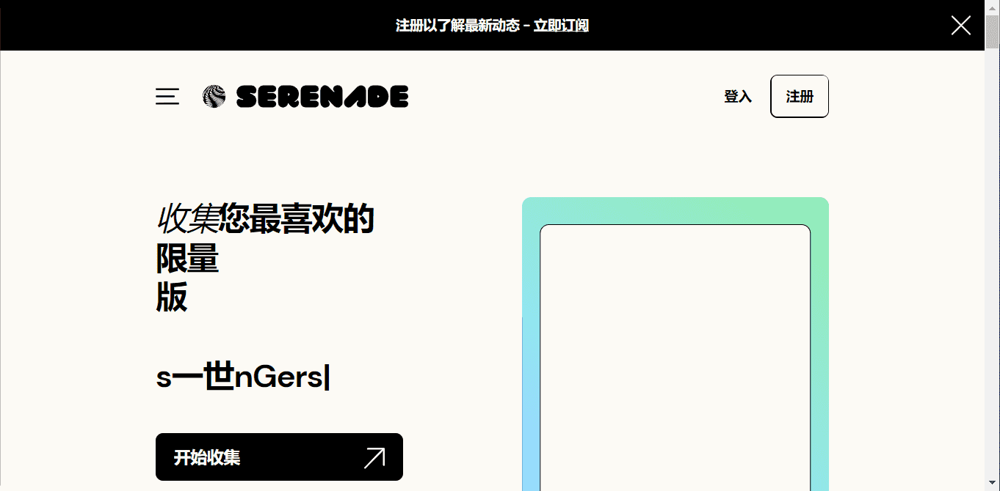

# Polite Teehee First Edition

通过今天收集数字印刷品来建立明天的唱片收藏
搜集
购买数字印刷品或收藏品，支持您最喜欢的艺术家并确保您在收藏家社区中的地位。
经验
构建、播放和展示您的收藏，解锁独家奖励，并与喜欢与您相同的音乐的其他粉丝建立联系。
交易（或不交易）
将您的压机安全地保存在小夜曲上，将它们转移到外部钱包或在任何支持 web3 的市场上交易和销售。

收集来自标志性和新兴艺术家的限量版作品
策划作为先行的时尚达人，展示您珍贵的印刷品和收藏品
直接从您最喜欢的艺术家和唱片公司那里解锁独特的奖励
通过艺术家自己的语音信息，揭开音乐背后的故事
借助安全可靠的区块链技术，支持艺术家及其作品
加入一个真正关心音乐的社区——就像你一样

