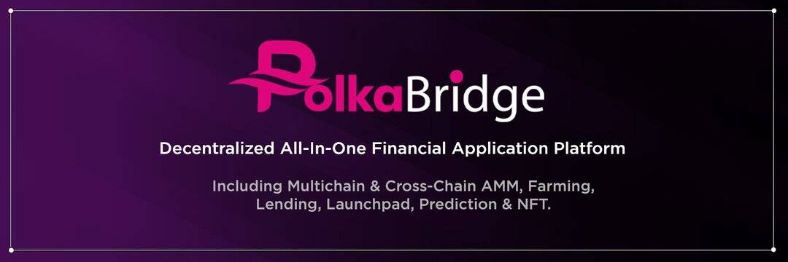

# PolkaBridge

PolkaBridge 是一个去中心化的应用平台。PolkaBridge 最引人注目的产品之一是 PolkaBridge DEX——一个去中心化的交易所，它允许用户在没有任何中心化组织的情况下将 Polkadot 上的代币交换到其他区块链平台上的其他代币。

**为什么选择波卡？**

- Polkadot 生态系统正在快速增长。 

- 交易费用低于以太坊。 

- 可扩展性，平行链上的快速交易处理。 

**为什么选择波卡桥？**

PolkaBridge 的诞生是为了将所有区块链统一为基于 Polkadot 的单一网络的垫脚石，继承了许多不同区块链平台的所有优势。

此外，通过智能合约通缩机制，农民可以通过挖掘流动性赚取 90% 的 PBR 交易费用。 

PBR 持有者有机会参与在 PolkaBridge Launchpad 上启动的 IDO。 

未来还会有借贷和预测，这将为我们的支持者带来更高和更稳定的利润。
