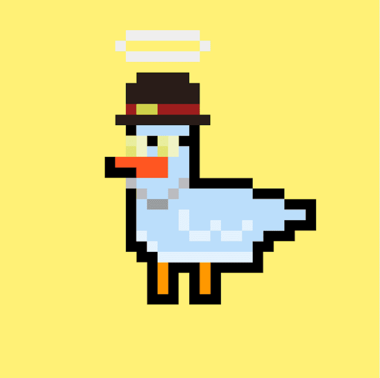

# Poly Duckz

Poly Duckz 是 Polygon 区块链上 9999 只鸭子的游乐场。每只鸭子都是独一无二的，由 180 个特征以编程方式生成。他们喜欢派对、电子烟和眼镜，所以决定和人类一起生活。从我们有限的 NFT 收藏中获得一只鸭子，以保证您有机会参加独家赠品、商品、派对。保持冷静，保持谦虚！不要错过金人

只有 9999 Poly Duckz 将永远存在，现在就得到你的

我们最初打算为所有宠物创建一个庞大的王国，将其安置在一个收藏品中（类似于 Zed Run），任何收养者都可以在那里繁殖并获得收益……这个项目最初是一个拥有 1111 人的纯艺术社区，只是像我们一样，想要亲身体验 NFTS，没有计划、路线图或 BS，

