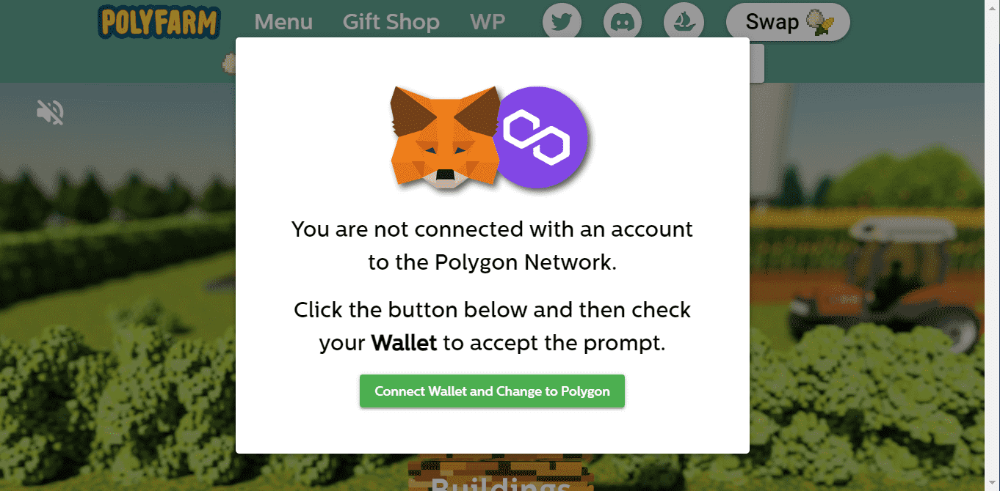

# PolyArtifacts

PolyArtifacts 统计数据
创建于 7 个月前
18 代币供应
7.5% 费用
7,130 位推特关注者
PolyArtifacts NFT 在过去 7 天内售出 1 次。PolyArtifacts 的总销售额为 4.99 美元。一个 PolyArtifacts NFT 的平均价格为 5 美元。有 250 个 PolyArtifacts 所有者，总共拥有 18 个代币。

神器将是一系列工具和装饰品，它们可能会对您的农场产生微小的推动作用，并且只能通过限量版掉落获得。

夏季阳光明媚的一天开始了，农田和森林在其辉煌中，这似乎是一个正常的一天。但是狐狸队的狡猾计划已经开始，他们知道雌鸽们会竭尽全力保护他们宝贵的$EGG，但他们能把它们全部保留下来而不会有失去它们的风险吗？一个风险回报的经济游戏，每一个动作都很重要。没有 IPFS。没有 API。所有存储和生成 100% 链上

