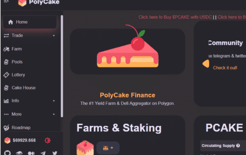

# Polycake Finance

Polygon 上排名第一的 Yield Farm 和 Defi 聚合器。所谓DeFi中的聚合器,就是一个支持多种 DeFi 协议的聚合平台,它可以在各个提供流动性挖矿的DeFi协议之间自动进行移仓,帮助用户获得更高的收益。简单来说,就是DeFi世界中的一个基金产品。只不过把中心化的投资团队给去掉,由代码写好的智能合约来代替行使传统基金投资理财的功能。

