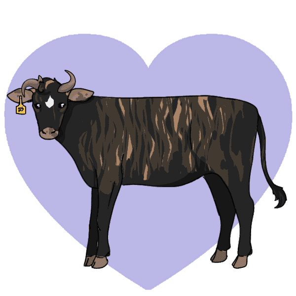

# PolyCows 10000 Polygon NFTs

PolyCows 是生活在 Polygon 区块链上的 10000 个独特 NFT 的集合。PolyCows 是通过使用自定义代码并合并我女儿创作的数十层独特手绘艺术而生成的。每个 NFT 都是独一无二的，都有自己的稀有性。PolyCows NFT 也是会员卡，可以享受独家福利和奖励。

FunJibles 可替代代币
我们涵盖了社区、独特的艺术、稀有性和价值。实用性呢？

每头牛每天最多掉落 50000 个 FunJibles 代币

用 FunJibles 兑换加密货币，用 FunJibles 铸造 PolyCows，在游戏中使用 FunJibles 代币！耕种和质押即将推出！

