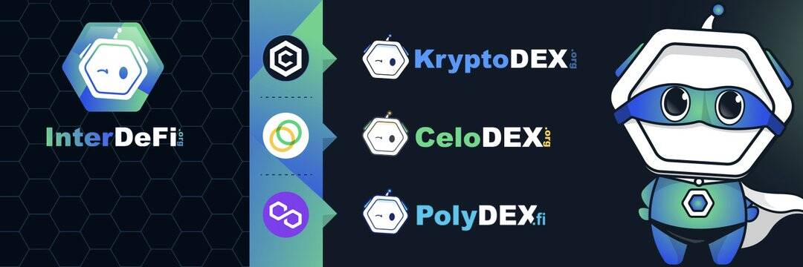

# PolyDEX

PolyDEX 是 Polygon Network 上最新的 AMM。它旨在成为支持多链IDO和IFO的首选平台。在 PolyDEX 上启动的项目将受益于广泛的服务，包括 Staking Pools、Trading Battle、NFT 市场等。

它还通过创新的游戏化农业机制和广泛的投资范围在 Polygon 上提供单产农业。PolyDex 允许用户在 Polygon Network 上交换代币、通过农业提供流动性以及赚取费用和推荐。
