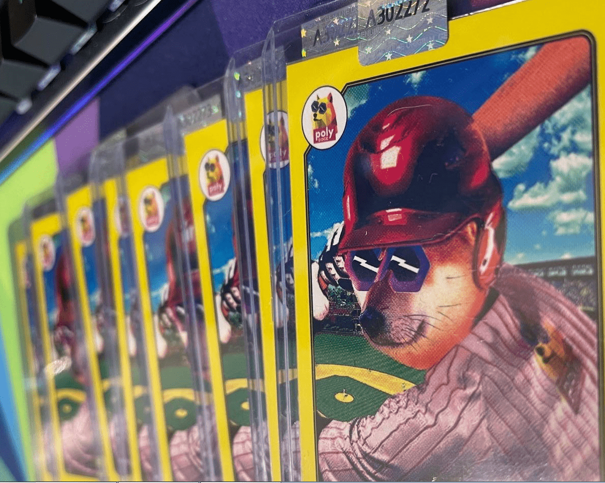

# PolyDoge Baseball

它是由传奇艺术家 Dines 和 Colin Perras 创作的——在内部 PolyDoge 之王！
2021 年 6 月 12 日，Polydoge 帮助赞助了在德克萨斯州阿灵顿举行的 2021 年名人垒球经典赛。
通过这项赞助，Polydoge将帮助打击贩卖儿童，同时还为美国堕落和残疾服务人员的配偶和子女提供教育奖学金。
名人垒球经典赛受益于荣誉折叠和儿童救援兽医，特色是由音乐家、电影/电视演员、真人秀、职业运动员等组成的男女同校名人垒球比赛（包括我们自己的体育主管关系和前 MLB 游骑兵投手 Gerald Smiley！）
我们会见了几位名人球员，他们想感谢所有参与这项事业的人。
为了纪念这一天，我们铸造并分发了与 NFT 完全相同的卡片，以代表这个社区加强并回馈的夜晚。

