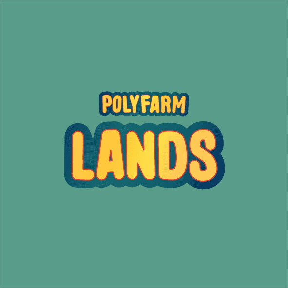

# PolyFarm Land - Official

PolyFarm Land - 官方 NFT 在过去 7 天内售出 3 次。PolyFarm Land - Official 的总销售额为 $41.17。一份 PolyFarm Land - Official NFT 的平均价格为 13.7 美元。有 804 个 PolyFarm Land - 官方所有者，拥有 2,000 个代币的总供应量。

世界地图将从仅发现的一部分开始，即中央城镇，以及它周围的 2000 块土地。靠近市中心的前 600 个土地将成为创世纪区的一部分，接下来的 1400 个土地将成为农村区的一部分。其中每一个都将在未来赛季中拥有特殊资源。

