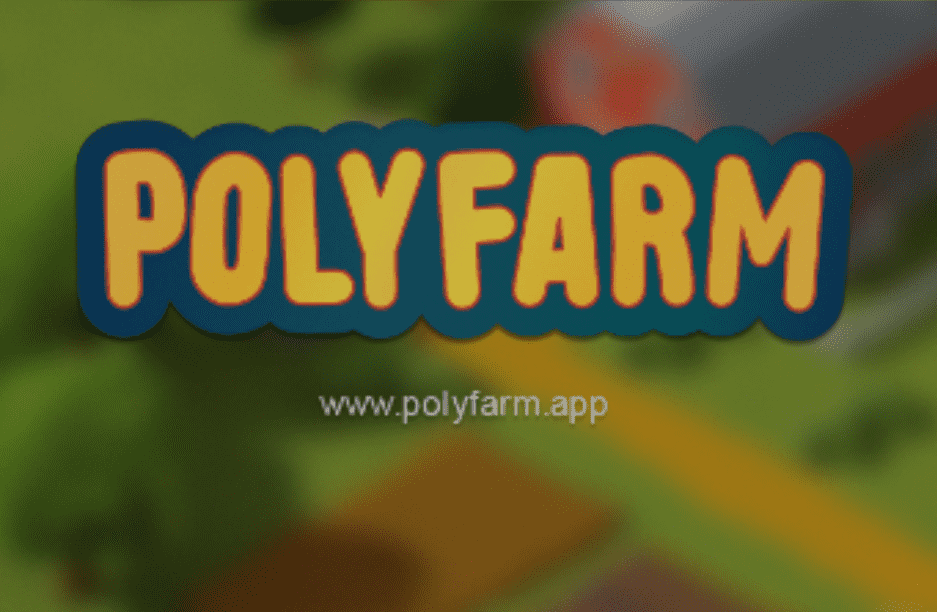

# PolyFarm Lands

olyfarm 是一款创新、有趣且具有风险回报的经济游戏，每一个决定都很重要。PolyFarm 如此特别的原因在于 ERC-721 和 ERC-20 代币的交互和组合，一切都 100% 发生在链上。这是 NFT 世界中独一无二的游戏。
准备好探索这片土地，收获庄稼，并成为互动社区的一部分，还有更多令人兴奋的事情即将发生。
游戏最关键的方面之一是季节。那么他们呢？
好吧，游戏从夏季开始，Foxes 和 Hens 试图获得尽可能多的 $EGG。但是到了秋天，规则会改变，雌鸽不会产生那么多的$EGG，游戏的新元素会随着独特的机制而出现。有些物品只能在特定季节生产/收获，您将需要它们来升级您的农场并购买新的 NFT。在出售和为未来储蓄之间找到平衡将是真正的挑战。

