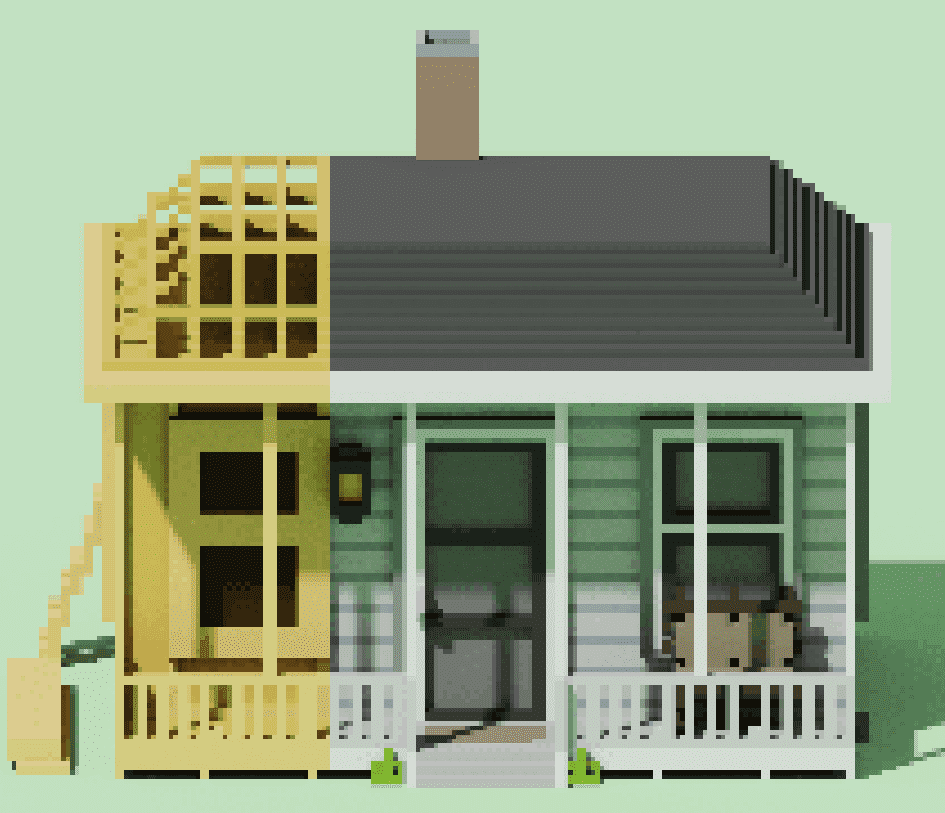

# Polyfarm Buildings

▶ 有多少 Polyfarm Buildings 代币？
总共有 52 个 Polyfarm Buildings NFT。目前，540 位业主的钱包中至少有一个 Polyfarm Buildings NTF。
▶ Polyfarm Buildings 最昂贵的销售额是多少？
最昂贵的 Polyfarm Buildings NFT 是 Farmer's House - Level 6。它于 2022 年 6 月 25 日（2 个月前）以 20.9 美元的价格售出。
▶ 最近售出了多少 Polyfarm 建筑物？
过去 30 天内共售出 15 个 Polyfarm Buildings NFT。
▶ Polyfarm 建筑的成本是多少？
在过去 30 天里，Polyfarm Buildings NFT 最便宜的销售额低于 2 美元，最高销售额超过 35 美元。在过去 30 天内，Polyfarm Buildings NFT 的中位价格为 5 美元。
▶ 什么是流行的 Polyfarm Buildings 替代品？
许多拥有 Polyfarm Buildings NFT 的用户还拥有 PolyFarmers、 PolyFarm Official、 PolyFarm Land-Official和 PolyArtifacts。

