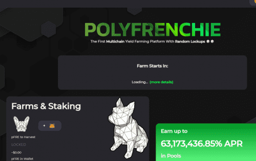

# Polyfrenchie Finance

POLYFRENCHIE是第一个随机锁定的多链收益农业平台，Polyfrenchie Finance 是一个在币安智能链和 Polygon 上运行的去中心化多链农场收益项目。

**POLYFRENCHIE特征**

- Yield Farm：通过质押流动性池代币来赚取 pFRE 代币，我们的平台上有一个独特的功能，称为随机锁定
- 推荐系统：通过分享链接赚取 pFRE（您朋友收获的 2%）
- 游戏：通过玩平台的不同游戏赚取 pFRE
- 自动 pFRE（很快）：自动复合您的 pFRE 质押，非常棒的功能。
- pFRE 股票（很快）：质押您的 pFRE 并赚取 USDC、MATIC、BTC、ETH 等代币...

