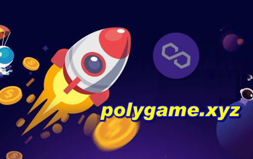

# PolyGame Dapp

PolyGame Dapp 社区是关于游戏、加密教育及其机制的。 

PolyGame 基于跨链 Polygon 和 BSC 网络，如何桥接 BSC 和 Polygon，反之亦然，如何在农业及其奖励中进行质押，以赚取收益，去中心化，从属和创新。

PolyGame 社区，为所有想要参与的人打造加密财富。 PolyGame 是一个链上测试版，可证明公平的去中心化教育 BSC-Polygon 跨链游戏，为加密英雄赚取收益。 它是一个封闭的生态系统，适用于 PolyGame 社区内的所有参与者和所有人。 用更简单的话来说：这是最疯狂的区块链野兽机器！ 

随着社区利益的增长和参与，利润可能会在无意中变得疯狂弹道！ PolyGame 希望你喜欢这个疯狂的开放世界 web 3.0 教育加密冒险。请自由探索和接近目标！

