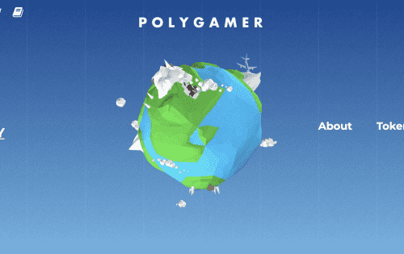

# PolyGamer

PolyGamer 由位于亚洲的区块链游戏开发团队创立，自2015年以来，团队一直在开发手机小游戏。从 2018 年开始，团队开始研究区块链技术，并在以太坊网络、EOS、TRON 和币安智能链网络上尝试开发小游戏。PolyGamer 的目标是在以太坊主网上推出更多游戏，但高昂的汽油费会阻止用户参与和玩游戏。

现在，借助 Polygon 的第 2 层扩展解决方案，PolyGamer 能够利用以太坊社区并为每个人构建运行速度更快、成本更低的游戏。PolyGamer 很高兴成为 Polygon 的早期开发者之一，PolyGamer 希望吸引更多的游戏开发者进入这个生态系统。
