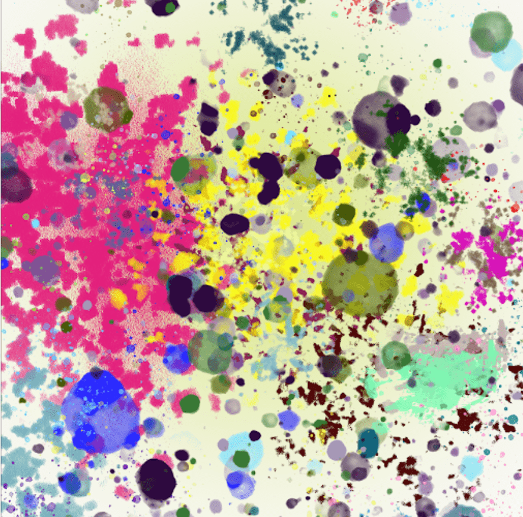

# Polygon Riot Of Colors ART

。是一个独特的画布上 50 个手绘图层的集合，每个图层都被数字化并随机生成为 5,555 个独特的 NFT 艺术。

▶ 什么是多边形色彩艺术？
Polygon Riot Of Colors ART 是一个 NFT（不可替代代币）系列。存储在区块链上的数字艺术品集合。
▶ 有多少 Polygon Riot Of Colors ART 代币？
总共有 5,556 个 Polygon Riot Of Colors ART NFT。目前，311 位所有者的钱包中至少有一个 Polygon Riot Of Colors ART NTF。
▶ 最昂贵的 Polygon Riot Of Colors ART 拍卖会是什么？
售出的最昂贵的 Polygon Riot Of Colors ART NFT 是 Polygon Riot Of Colors ART。它于 2022-06-10（3 个月前）以 2.8 美元的价格售出。
▶ Polygon Riot Of Colors ART 最近卖出了多少？
在过去 30 天内售出了 1 个 Polygon Riot Of Colors ART NFT。

