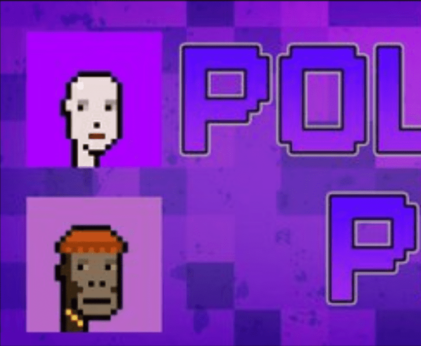

# Polygon Punk

Polygon Punk 是一个社区主导项目，用于在 Polygon Chain 上创建 Punk OG。

朋克是 NFT，这些朋克中的每一个都具有根据定义的稀有系统使它们独一无二的属性。

每个 NFT 将以 80:20 的比例随机定价为 0.005 或 0.009 ETH。20% 用于营销和协作计划。（任何批次的薄荷价格都不会上涨）。

关于我们的铸币流程：

Polygon Punks 将根据需求每周批量铸造，直到达到 6969 的总供应量。作为我们建立社区的核心重点，而不是倾销 Nfts。

正如我们相信“社区创造价值”一样，我们将每天进行赠品，直到所有批次都售完为止。这有助于我们发展我们的社区并建立我们的品牌。

