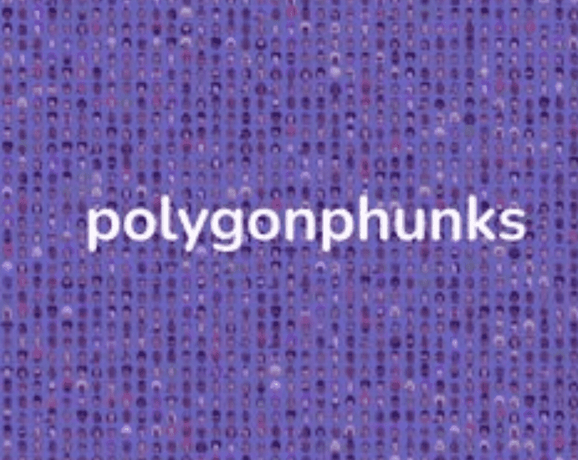

# PolygonPunks

这 10,000 个 PolygonPunks 中的每一个都具有根据定义的稀有系统使其独一无二的属性。2021 年 12月，通过 polygonpunks.io 网站正式铸造了 10,000 个朋克的全部集合——巩固了他们作为 Polygon 上第一个朋克的历史。

是 PolygonPunks 的朋克版。朋克是面向左的朋克，我们正在颠覆企业现状，并通过概念艺术创建真正的 Web3 范式。PolygonPhunks 是 Polygon 区块链上的 NFT。这 10,000 个 PolygonPhunks 中的每一个都具有根据定义的稀有系统使它们独一无二的属性。

