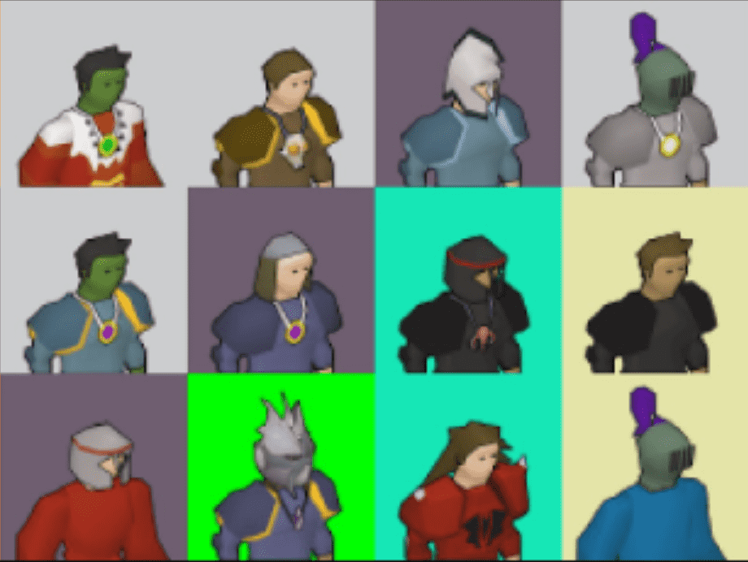

# Polygonscape

PolygonScape 以程序方式生成的生活在 Polygon 区块链中的独特收藏品。我们中只有 2277 人幸存下来。

世界上第一个也是最大的加密收藏品和不可替代代币 (NFT) 的数字市场。购买、出售和发现独家数字商品

▶ 什么是多边形景观？
Polygonscape 是一个 NFT（不可替代令牌）集合。存储在区块链上的数字艺术品集合。
▶ 有多少 Polygonscape 代币？
总共有 2,276 个 Polygonscape NFT。目前，98 位所有者的钱包中至少有一个 Polygonscape NTF。
▶ 最近卖出了多少 Polygonscape？
过去 30 天内售出 0 个 Polygonscape NFT。

