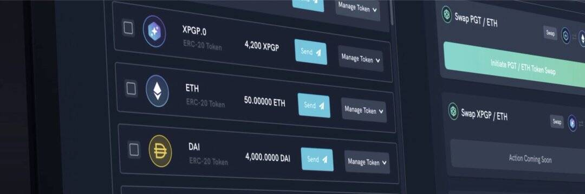

# Polyient DEX

Polyient DEX (PG DEX) 是 Polyient Games 生态系统的官方去中心化交易所。

Polyient DEX 的 V1 是 Uniswap V2 的分叉，是最大的 Polyient Games Governance Token (PGT) 流动性池的所在地。PGT 持有者通过从领先的区块链游戏、NFT 和 DeFi 项目列表中批准新的掉期市场添加，在 Polyient DEX 中发挥直接作用。
