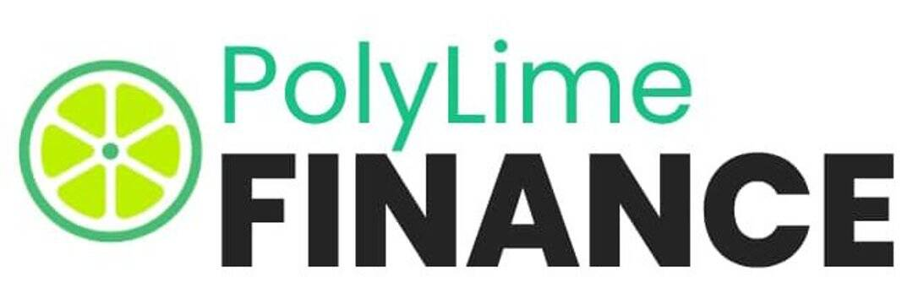

# PolyLime Finance

PolyLime Finance是 Polygon 网络上的下一代单产农业协议，具有许多独特和创造性的功能，可让您获得被动收入。

Polygon的愿景是建造以太坊的区块链互联网。简而言之，Polygon提供了一个通用框架，允许开发人员利用以太坊安全性创建定制的，专注应用程序的链，并提供一个可互操作的网络，将各种不同的扩展解决方案链接在一起，例如zkrollup，op-rollup和侧链。

PolyLime Finance的特点是有限的代币供应、LP Farm、Staking 工具、自动复利和股息池。Polylime 由 Paladin 和 RugDoc KYC 审核。

