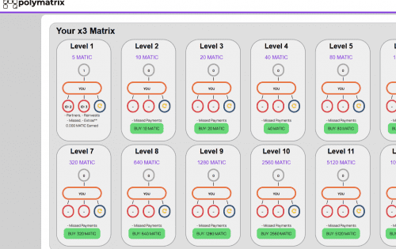

# PolyMatrix

PolyMatrix是最安全、最快速、最高效的矩阵智能合约~P2P 支付直接进入您的钱包，只需加入即可赚取红利。

智能合约是一套以数字形式定义的承诺（promises），包括合约参与方可以在上面执行这些承诺的协议，是一种用计算机语言取代法律语言去记录条款的合约。

智能合约的讨论在比特币开始就进行了，数字资产、智能资产意味着区块链的交易不仅仅只是局限于买卖货币这么简单，会有更多的指令嵌入到区块链中。一个合约就是通过区块链使用比特币和某人形成某种协议。

