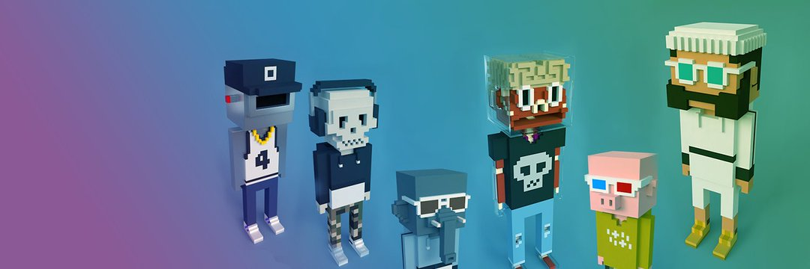

# POLYMEEBITS

PolyMeebits 是稀有的 20,000 个独特 3D 头像集合，具有 9 个不同的属性，是 Polygon 智能链上的第一个 Meebits 集合！

该系列包括：5 Dissected、10 个 Sandeep Nailwal（创始人）、10 个 Polymeebits（独特角色）、18 个访客、57 个骷髅、72 个机器人、256 个大象、711 头猪和 18862 个人类。PolyMeebits 与 Larva Labs 无关无论如何，尽管我们感谢他们启发了这个项目！

