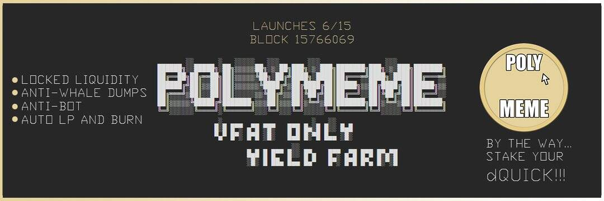

# PolyMeme

PolyMeme是一个只有真正爱好者的 vfat 农场。Polygon 上的收益农业 $MEME。

**代币：**

* 符号：MEME  

* 反鲸鱼（0.1% 最大总供应转移量）  

* 5% 转账费 - 2% 烧毁，3% 增加流动性  

* 500 代币预挖：400 到 LP & 100 用于促销和成本  

* 流动性锁定：0xB6b9f14A318063BA44D5f21D34fEF0E1016ECA8c 

  

**农业：  **

* 主厨：0x1A7Cee127cF9ABc8586e422d8ab5e336298D0472  

* 农业开始区块：15766069 - 世界标准时间 6 月 15 日星期二晚上 10 点  

* 区块收获开始时间：15895669 - 世界标准时间 6 月 18 日星期五晚上 10 点  

* 收获冷却时间： - 原生：12 小时 - 非原生：20 小时 押金：  

* 本地农场 0% * 非本地农场 2% 注意：  

* dQUICK 没有流动资金池，因此代币价格和市值将为 0。这不影响挖矿奖励！
