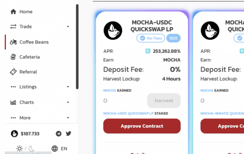

# Polymocha Finance

PolyMocha Finance 是 Polygon Matic 网络上的一个新的 DeFi 项目。这是 PolyBrew 项目的第二层，以 MOCHA 为特色，最大供应量为 70,000 个代币。

在审查了几种单产农业模式后，我们决定在我们的平台上采用低排放率、低供应、分层农业方法。这种模式将帮助最终用户在很长一段时间内获得最大收益。

**PolyMocha Finance特征**

- 70,000 个摩卡代币
- 0.01 排放
- 为 Brew 和 Mocha 代币持有者持续赚取收入的分层耕作
- 多 dex（QuickSwap 和 SushiSwap）
- 3% 推荐
- 摩卡合约：- 0x1A1A5D121D5EbEBD0761D95E332E7f57AC4462a9
- 摩卡主厨：- 0x389f26DbCc36cBf7f87dD4271C75a566A73bdAc3
- MOCHA 代币合约的所有者是 Masterchef
