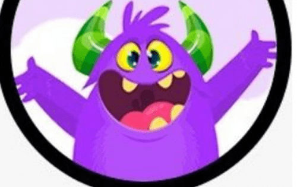

# POLYMONSTERS

Monster 是研究和结合 DeFi 生态系统中最好的 Yield Farming 项目的结果。

Monster 向他们学习，甚至改进了有关代币经济学和安全性的关键特性。Monster 很自豪能够向Monster 的投资者提供这个平台，因为Monster 确信它是一流的产品。

当农业开始时，由于转让税和回购和销毁机制，总代币供应量将逐渐减少。这种代币逻辑有利于流动性供应和价格稳定。 此外，随着 APR 随着时间的推移而降低，MONSTER 供应压力也会降低，作为价格上涨的额外因素。 

masterchef 3.0 的创新特点是总代币供应量是固定的，这种合约不能铸造无限的代币，导致高通胀和价格贬值。

