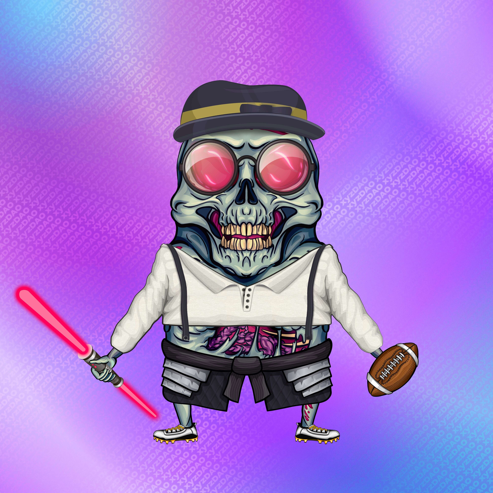

# Polymorphs

多态宇宙
Polymorphs 是变形 NFT 的集合，具有11 个基础皮肤和200 多个特征。
认领你的多态面孔
每个 V1 Polymorph 被烧毁都会获得一个免费的 Polymorphic Face 声明！
多态面是为了争夺而建造的，只能通过燃烧 V1 多态来获得。
什么是多晶型物？
我们相信，Polymorphs 是 Web3 生态系统技术先进 NFT 浪潮的开端。像我们之前的许多系列一样，多形体的存在具有稀有性和特征，但具有旋转性。它们可以根据主人的命令变形，随着时间的推移改变它们的外观。

