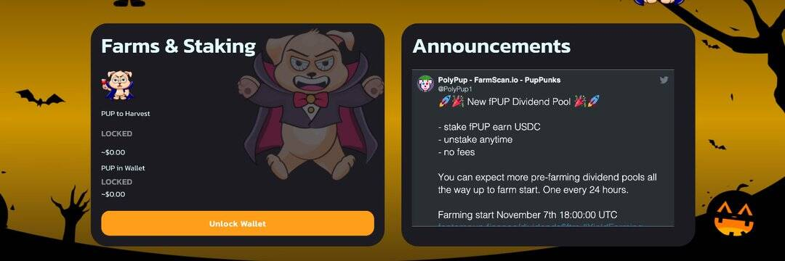

# PolyPup Finance

PolyPup Finance 是 Polygon 上的一个新 DeFi 项目，采用通货紧缩代币模型，最大供应量为 31,000 个 PUP 代币。在审查了几种单产农业模式后，PolyPup Finance决定在平台上采用低排放率、低供应、分层农业方法。这种模式将帮助最终用户在很长一段时间内获得最大收益。回购和销毁将有助于稳定长期持有者的价格底线。

**PolyPup Finance特征**

- 最多 31,000 个 PUP 代币
- 0.05 排放率
- 押金将用于销毁、广告和开发费用
- 分层耕作以持续赚取第一代 PUP 代币持有者

