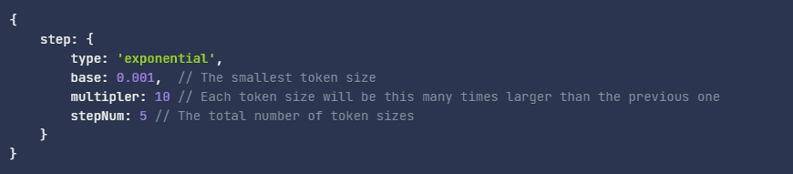

# PolyToken

Polytoken 是一种实用程序，用于处理一个或多个任意数据维度的哈希处理，以便在数据库索引和查询中使用。

Polytoken 被设计为一个地理哈希库，可扩展到多个任意维度。当只有一个 LongLat 维度传递到 Polytype 中时，它将充当一个简单的 geohasher。如果同时传递 LongLat 和 Time 维度，则可以对在某个区域和时间范围内发生的数据进行哈希处理（例如，游行）。还可以扩展 Dimension 类以针对特定目的创建新维度。

每个维度的选项参数指定如何生成标记。通常，需要呈指数级增长的令牌大小范围，步骤下的字段指定其生成方式。

**示例对象：**

应仔细选择这些参数。乘数值越小，stepNum 值越大，令牌生成的准确性越高，代价是 getTokensForPoint 生成的令牌越多，这将线性增加查询的执行时间。
