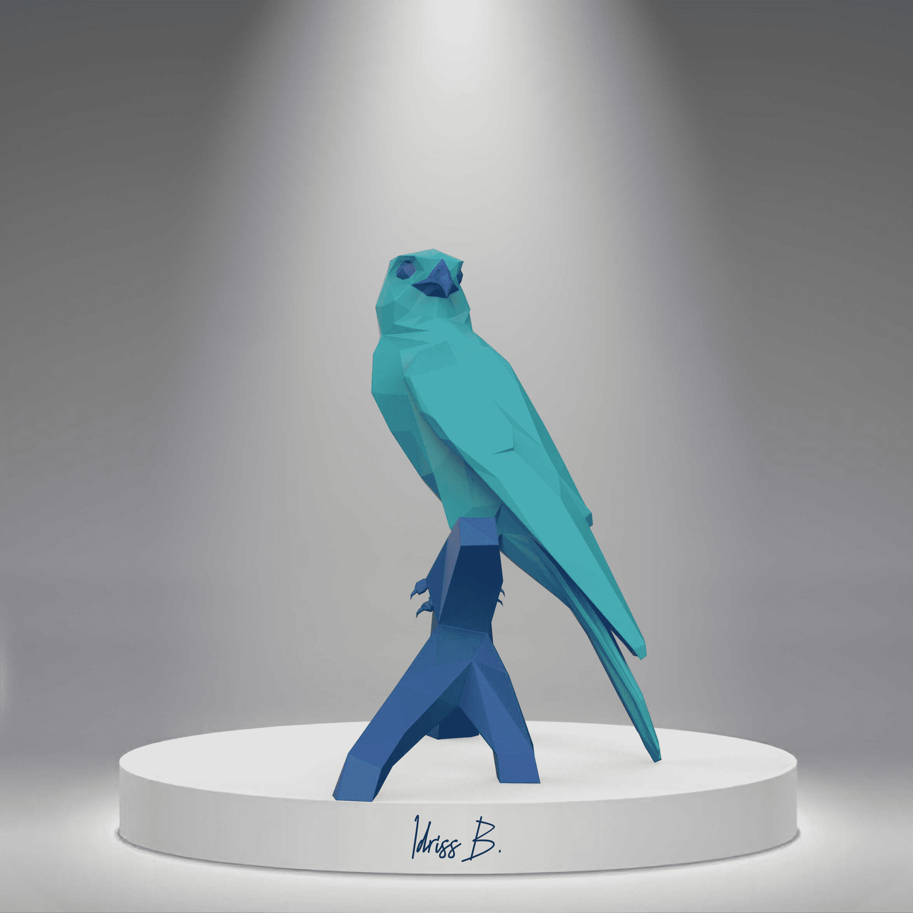

# Polyverse Art by Idriss B.

Polyverse Art 是 11001 个独特的 Polyverse NFT 的集合，在以太坊区块链上推出，由世界知名艺术家 Idriss B 创作。Polyverse Art 有可能以低于其价格的一小部分的价格首次拥有作为 NFT 的独家雕塑. 作为这些 NFT 的所有者，您将获得 Idriss B 最新作品的独家访问权，以及 VIP 艺术展、私人音乐会、时装秀、珠宝和特权访问权。
伊德里斯在巴黎出生长大，从小就对艺术表现出浓厚的兴趣。凭借对新材料、不同来源组合和各种手工艺术品的丰富知识，伊德里斯开始考虑新系列。这个系列是通过塑造他对当代艺术的愿景，创造出不同尺寸的多边形动物形式，然后作为限量版作品出售给收藏家。目标是让每个人都有机会拥有独一无二的艺术品。

