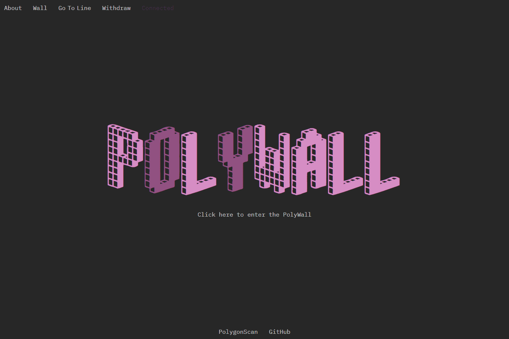

# PolyWall

**什么是 PolyWall ？**

这是什么？它是免费的吗？有什么规则吗？

PolyWall 是存储在 Polygon 区块链上的纯文本文件。这面墙上有 2^256-1 行。每行长度为 100 个字符。

新线路的创建是免费的。对一行的每一次修改都会增加 0.01 MATIC 的编辑成本。如果有人替换了您的文本，您将收到已支付金额的 90%。

你可以自由地写任何你喜欢的东西。墙永远不会被缓和。我们相信言论自由是每个人不可剥夺的权利之一。留言。它将存储在链上。永远。查看网站自己尝试一下。

此外，您可以使用 PolyWall CLI（在 github 上）上传文本文件。

