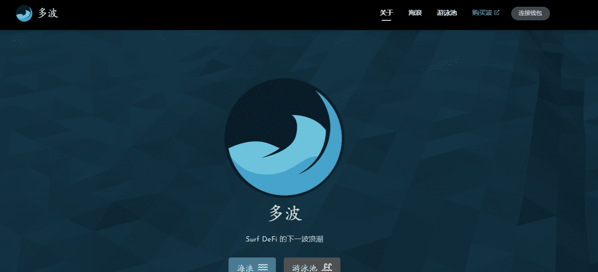

# PolyWAVE

**什么是 PolyWAVE ？**

Polywave 是一个由 surf.finance 生态系统支持的项目。通过持有 WAVE，您就拥有了金库的所有权。WAVE 最初可以通过使用 matic/wave 质押单个资产或 LP 来耕种。产生的部分费用将用于支持 WAVE 代币和 SURF 资产。另一部分用于部署到其他协议中的 WAVE 令牌库。还有 0 开发费和 0 铸币。

**社区拥有的保险库**

polyWAVE 将拥有一些有史以来第一个社区拥有的保险库，可以与 WAVE 持有者分享利润。通过持有 WAVE，您可以获得团队费用和收益。

作为一个去中心化的对冲基金，重要的是使持股多样化，我们将通过积累 Polygon Treasury（目前由 polyWAVE 池中的费用资助）并增加不同的收入流来实现这一点。独立于 SURF 代币定价的收入流，适当地应用于生态系统，应该有助于保护代币的价值。

**公平分配**

所有 WAVE 代币中有一半（500 万个 WAVE）是通过初始流动性事件分发的。任何人都可以存入 MATIC 并收到与存入 IFO 的总金额成比例的 WAVE。所有存入的 MATIC 都用作 Quickswap 的流动性并存储在国库合约中。

剩下的一半 WAVE 代币用于奖励在任何池中质押的用户。WAVE 将获得无限期奖励，但排放量会随着时间的推移而减少。

**单一资产农业**

用户可以轻松抵押 ERC-20 代币，如 USDC、WETH 或 WBTC，而无需提供流动性或处理无常损失。
每个池以不同的比率奖励 WAVE，池中锁定的价值越多，每投入一美元的奖励就越低。大多数矿池都有存款和提款费，但每笔费用的一部分会作为 WAVE 奖励分配给该矿池中的每个人。
