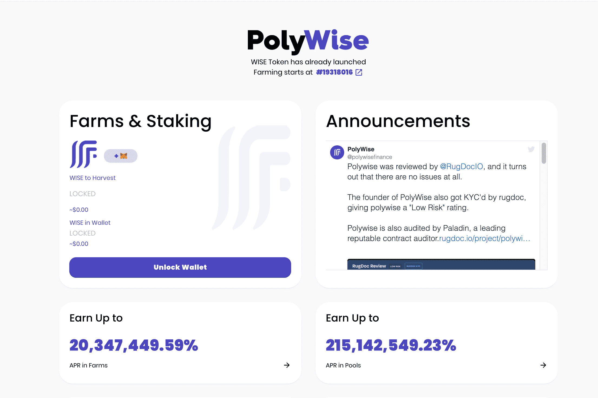

# PolyWise

**什么是 PolyWise ？**

PolyWise Finance是Polygon网络上的下一代收益农业协议，具有许多独特和创造性的功能，使您能够获得被动收益。

在 polywise 上，您将能够在我们的收益优化农场池中质押 LP 代币，以收集WISE代币的收益。我们的乘数设置方式使得提供流动性受到高度激励，并且很可能会产生正的投资回报率。

PolygonWise 社区成员还可以在我们的收益优化的单一权益池中质押农场代币、成熟的蓝筹加密货币和/或稳定币。单一权益池是一种流行且相对安全的 Defi 投资方式，因为这种方法不会使投资者面临涉及无常损失的风险。

