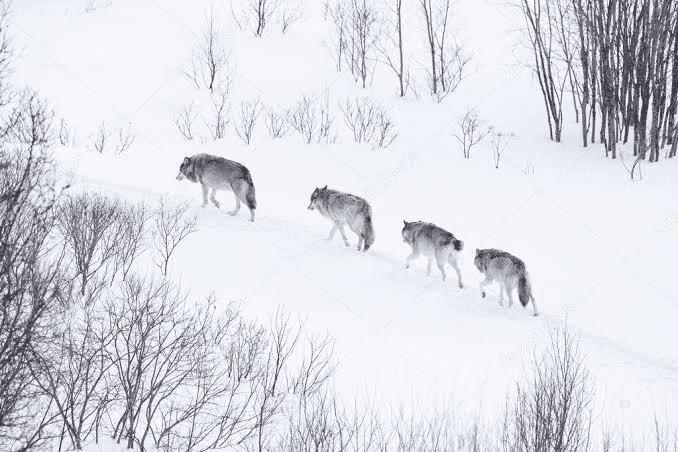

# PolyWolf

**什么是 PolyWolf ？**

PolyWolf 是一个在 Matic 上运行的去中心化收益农场，具有许多其他功能，例如收益聚合器和 wolfpack 功能。

我们正在尝试做的是创建最终的去中心化平台，可以满足您的大部分 DeFi 需求。在质押/耕种时赚取 WOLF 和其他硬币（待定）。移除了迁移代码（继承自 Pancake swap）,耕种外部协议并通过各种策略自动增加您的收益。来自此的费用将用于回购和销毁 WOLF。

我们的愿景是创建一个可以满足您所有DEFI需求的单一应用程序 - 当然，它始于农业，因为我们都喜欢产量。但我们的目标是提供可持续的收益和支持。作为一个项目，我们的主要重点是提供安全和可持续的解决方案，以解决该领域最棘手的问题。除非我们知道它是安全的，否则我们不会提交代码，除非我们相信它以某种方式为WOLF持有者创造了实用性  - 运行**POLYWOLF**的燃料， 否则我们不会提交代码。如你所知，狼总是作为一个群体团结在一起，由**阿尔法**，**阿尔法狼**领导。

**Alpha**也是一个术语，用于指获得最佳收益和隐藏特征的方法。我们将成为您的**阿尔法****狼**，并引导您获得最佳体验。一个释放加密潜力的生态系统和**一个令牌**来增强生态系统。耕种只是一个开始，我们打算给你多种工具来增强你的产量！我们的最终目标是在足够的流动性允许的情况下成为AMM。AMM将收取0.25%的掉期费用，**其中0.07%**将用于**回购和销毁**WOLF代币。

是的，我们希望为我们的狼创造一个稳定的环境。
