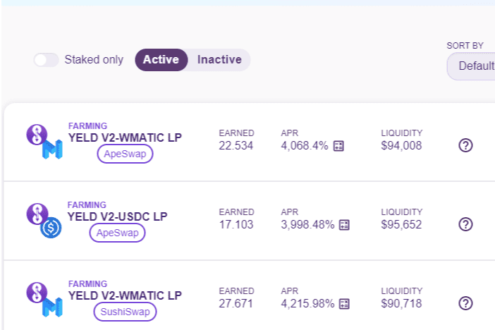

# PolyYeld Finance V2

**什么是 PolyYeld Finance V2 ？**

PolyYeld Finance 是 Polygon 网络上的下一代单产农业协议

PolyYeld Finance是Polygon网络上的下一代收益农业协议，具有许多独特和创造性的功能，使您能够获得被动收入。

我们正试图创建一个像Yen这样的协议，但代币供应减少，并为Polygon Network用户，LP提供商和权益提供者提供高价值。

只有86，000个YELD V2代币将在3-4个月内铸造

**主要特点**

有限的代币供应：YELD V2令牌的固定供应量为86，000个令牌。2000 V2 YELD代币将被预铸;1000用于补偿计划，1000用于提供初始流动性。

推荐计划：已经实施了一项链上推荐计划，以激励用户邀请朋友并通过农业赚取被动收入。推荐人可以永远获得他/她朋友收入的2%。

汽车焛：将您的YELD V2投注在我们的原生金库中，这会自动增加您的奖励。

耶尔德恩：YELD V2代币持有者可以通过$YELD V2代币来赚取稳定币（如ETH，WMATIC，USDC，DAI等）来享受成为投资者的好处。

存款费用再分配：当用户在PolyYeld上进入质押时，将收取一定%的存款费，但与其他收益农场不同，我们不打算使用存款费回购和销毁。这是浪费钱。相反，我们将把存款费用重新分配给YELD V2持有人，以鼓励持股。

**存款费用是如何分配的？**

存款费的75%将用于产生收入以运行YELDEARN，25%的存款费用将保留给开发团队。

