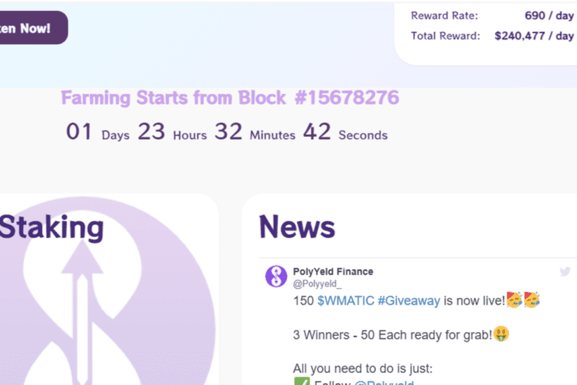

# PolyYeld Finance

**什么是 PolyYeld 金融？**

Polyyeld Finance 是 Polygon Network 上的下一代收益农业协议。

PolyYeld Finance是Polygon网络上的下一代收益农业协议，具有许多独特和创造性的功能，使您能够获得被动收入。

我们正试图创建一个像Yen这样的协议，但代币供应减少，并为Polygon Network用户，LP提供商和权益提供者提供高价值。

只有86，000个YELD V2代币将在3-4个月内铸造。

**有限的代币供应**

YELD V2令牌的固定供应量为86，000个令牌。2000 V2 YELD代币将被预铸;1000用于补偿计划，1000用于提供初始流动性。

