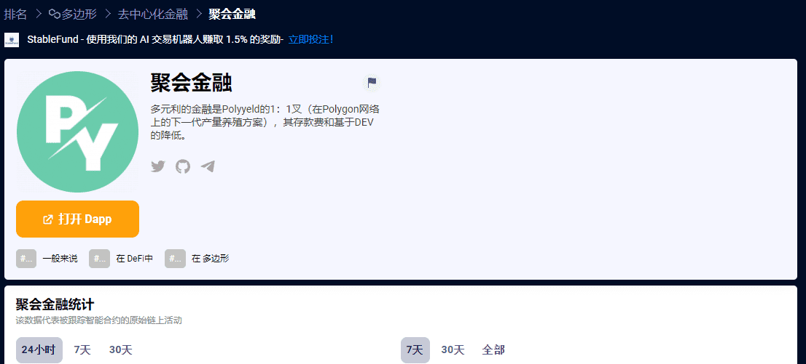

# PolyYield Finance

**什么是 聚会金融？**

PolyYield Finance是PolyYeld（Polygon网络上的下一代Yield农业协议）的1：1分叉，具有更低的存款费用和基于开发人员。

xYELD是PolyYeld生态系统中的创新令牌，具有自己独特的功能，将在PolyYeld仍处于铸造阶段时推出。PolyYelds的分层耕作方法并不是您在许多其他项目中看到的典型分层耕作方法，在这些项目中，第一代代币完成了铸造阶段并被带到下一层。相反，第二层造币阶段将在第一层之前结束，并将带回第一层。你可以称之为反向层农业。

引入另一层农业不仅将使Yeld代币持有者受益，而且还将吸引新的投资者，他们错过了我们首次成功推出的机会。自PolyYeld推出以来，我们已经建立了一个强大的社区，并赢得了投资者的信任。我们很乐意通过我们独特和创新的想法在多边形上提供最好的DeFi协议来回馈他们。
