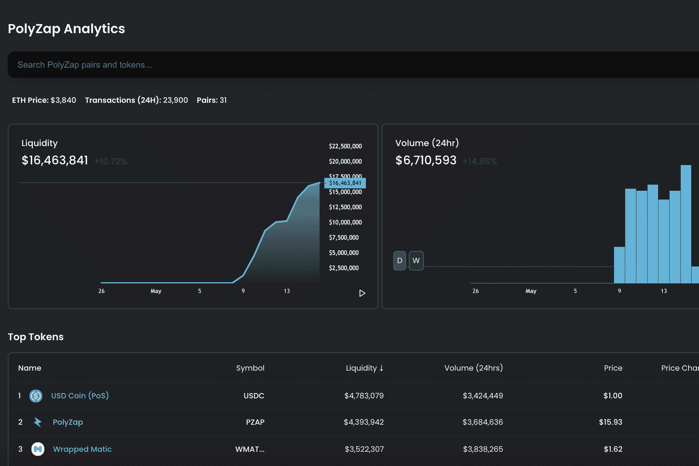

# PolyZap

**什么是 PolyZap ？**

PolyZap 是下一代产量农场优化器。

PolyZap是Polygon上最令人兴奋的分散式交易所。在Matic网络上交换任何想要的硬币，费用低得离谱。当我们说低时，您甚至不会注意到它离开了您的钱包。

尽管对于经验丰富的DeFi degen用户来说很熟悉，但PolyZap UI可能看起来很标准化，但是当您在引擎盖下查看其令牌组和发射调度时，您会发现这不仅仅是“另一个AMM”。

对于那些在整个DeFi领域没有经验的人，我们将对PolyZaps AMM和产量农业协议的优点进行举报之旅。

自动做市商（AMM）是一种协议，允许分散式交易所（DEX）在不像集中式交易所（CEX）那样运行的情况下运行。PolyZap是Matic网络上AMM的一个很好的例子。

PolyZap不依赖于通常在币安等大型交易所看到的常规订单簿模型。它实现了AMM协议，有效地允许其用户将其代币作为流动性提供，以便其他人可以与平台进行交易和交互。

最简单的方式是这个...如果你有PZAP和MATIC只是坐在你的钱包里，为什么不好好利用它们并赚取一些极好的兴趣呢？好吧，那么你是怎么做到的呢？好吧，您将它们作为流动性提供给PolyZap平台。

一旦您提供这些令牌（有效地将它们借出供协议使用），您将获得一些丰厚的奖励，因为这是一项如此出色的运动。奖励以您存入的代币偿还，并且通常作为奖励在平台上获得更多的本机代币，在这种情况下，PZAP。

*TLDR：系统需要令牌才能工作，以便您允许它们使用您的令牌。作为回报，您这样做可以获得丰厚的收益。非常简单。*

那么系统需要令牌做什么呢？好吧，在PolyZap上，因为它是DEX，人们正在寻求交易他们的代币。

