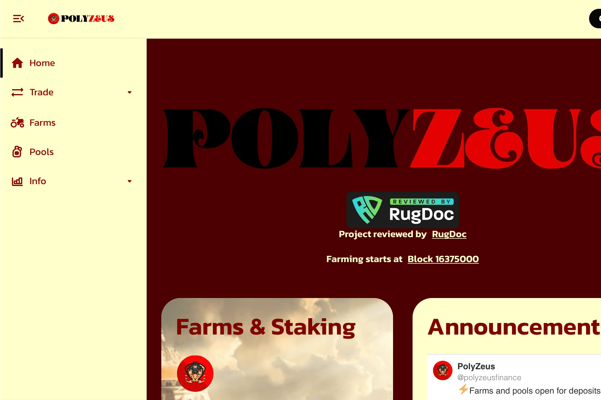

# PolyZeus Finance

**什么是 PolyZeus 财务？**

你好！我们是 PolyZeus，Polygon 上的第一个高价值农场。你可能想知道，“什么是高产农场！” 当然是有效的问题，让我们解释一下。

PolyZeus Finance是一个高收益农场。它由多边形网络提供支持。服务器场的本机令牌是 ZEUS。它可以通过抵押LP代币来获得。ZEUS还可以用作参与平台决策过程的治理令牌。

**PolyZeus Finance** dApp是建立在**Polygon**协议上的**DeFi**类别的加密资产。现在，根据用户数量，它在一般dApp排名中排名**第4169**位，在**DeFi**类别中排名**第1212**位，这使您可以很好地了解**PolyZeus Finance** dApp在其竞争对手中的表现。

通过分析PolyZeus Finance dApp在过去30天内的数据，很明显，dApp的**余额**为**0.00美元**，**交易量****稳定**在**0.00美元**。**PolyZeus Finance**已经产生了**7笔交易，**在**30天内下降了**30%。显然，与前7天相比，**交易量**稳定**了**0%**。过去7天的数据显示，PolyZeus Finance**用户群**为**7**，并且一直**稳定**在0%。

我们还建议查看**PolyZeus金融活动概述**和智能合约平衡图表，以了解这些重要指标如何随时间**波动**和变化。
