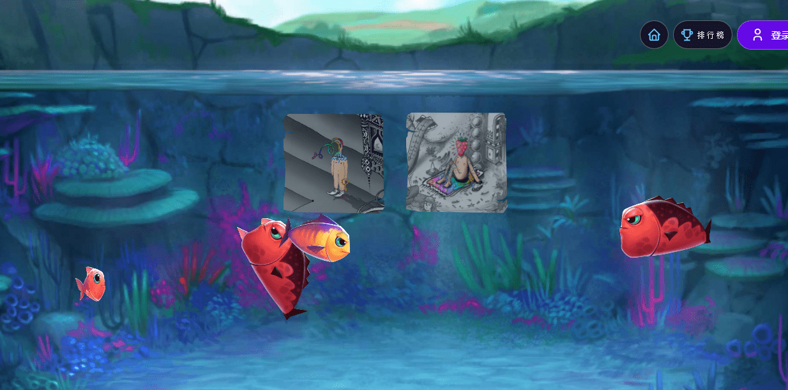

# Pondsama

一个回合制的5v5自动捕鲸器，建立在Moonsama Metaverse之上。

Pondsama在4天前复活，就在这个想法诞生后34天。Pondsama将成为一个基于2D浏览器的元宇宙，建立在Moonsama NFT之上。你将能够召唤你的鱼，建立自己的元池塘，在那里你的鱼会令人不寒而栗，最有趣的是你将能够与它们战斗。目前还没有透露很多细节，但我将假设这一切可以是什么，你怎么能参与到这个疯狂中。也许下面的一些信息不是100%准确的，因为我们仍处于开发阶段，还有更多信息即将被清除

**穿上西装，让我们潜入混乱的海洋！**

你需要成为Pondsama的一部分的第一件事就是一条鱼NFT。与其他项目相比，你通过向沉没的上帝提出要约来召唤NFT！你是怎么做到的？通过牺牲你通过玩屠杀收集的一些资源。更具体地说，你需要10$ aFish / 20 $ aGold / 50 $ aIron / 100 $ aWood / 500 $ aStone。当然，如果你不拥有这些东西，你可以在二级市场上买到它们。目前，上述所有资源的价格约为25MOVR。
