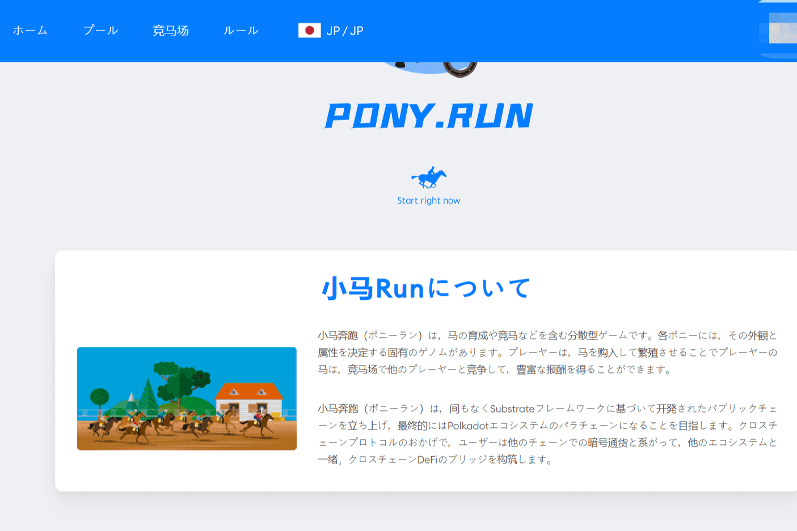

# Pony Run

**什么是 Pony Run？**

小马是一个集合匹马成分和马匹比赛的去化中心，每个玩家匹小马都跑的独一无二的基因组，能够决定它的外观匹马，能够通过购买和匹马，创造出属性和速成。玩家的匹匹在匹珍稀赛场上进行了比赛，基因获得了与其他马匹的能耐。

Pony Run 推出基础设施框架开发可以最终进行链上的公链运行，并成为未来链上生态链的使用，并与中其他链协议，Pony Run 上的加密用户进行互动。将与其他生态共同建设跨链的DeFi。

这个神奇的小马快跑是为女孩和男孩享受无尽的冲刺乐趣！这个令人兴奋的免费小马冒险有一些最可爱的小马。

加入数以百万计的玩家在你可爱的小马驹可以跑跳跃和冲刺。继续奔跑，跳过原木，漂亮的宠物动物，收集硬币，并在这个小马奔跑游戏中滑下滑梯。

